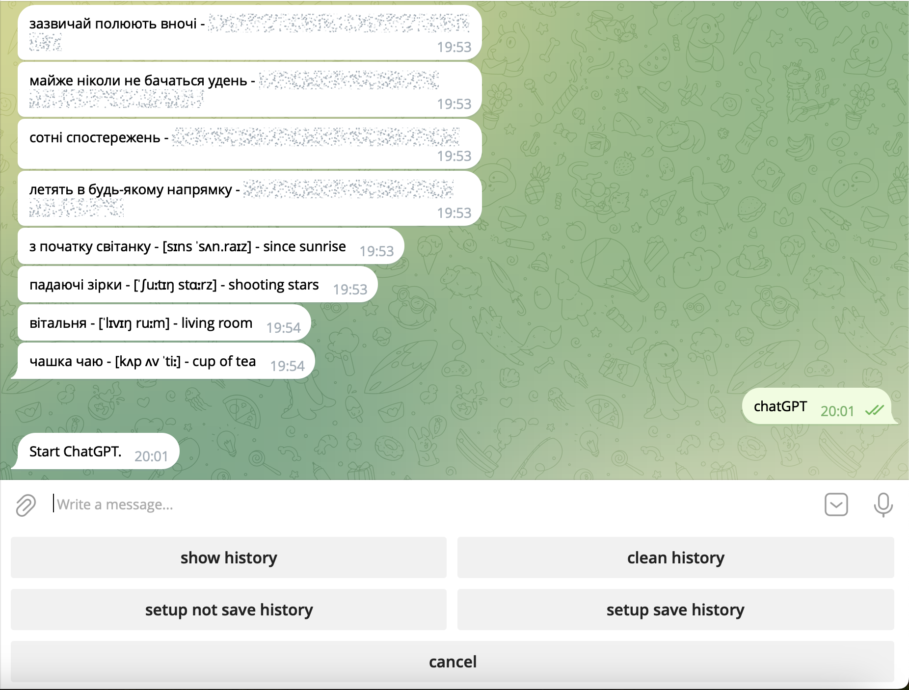

# 📖 Readnocry

Readnocry lets you enjoy books in English with its AI-powered translator. The primary benefit of using artificial intelligence for translation is its ability to understand context, idioms, and nuanced expressions. Additionally, AI can identify words and phrases that may be unfamiliar to you, based on your English proficiency level, and offer translations for these. App also provides the way of adding these terms to a dictionary and Telegram for easy access.

## Demo

https://readnocry.com/

## Tech Stack
Readnocry is built on a diverse and robust technology stack, ensuring a seamless and efficient user experience. Here's a detailed overview of the technologies used:

General:

**Java 17:** The core programming language providing stability and performance.

**Spring Boot:** The backbone for creating stand-alone, production-grade Spring-based applications with ease.

Database Management:

**Spring Data:** For streamlined data access and manipulation.

**PostgreSQL:** Our primary database, managing user information, books, and other essential data.

**MongoDB:** Employed for managing user dictionaries effectively.

Asynchronous Interactions Between Microservices:

**RabbitMQ:** A message broker enabling efficient communication between different parts of the application.

Security:

**Spring Security:** Ensures robust security measures are in place to protect user data and interactions.

Web Application:

**HTML + CSS:** For structuring and styling the user interface.

**JavaScript:** Adds interactivity to the web pages.

**WebSocket:** Used for real-time content updates without needing to reload the page.

Testing:

**SpringBootTest & Testcontainers:** A heavy focus on integration testing, with 90% of tests falling into this category, ensuring reliability and robustness.

Deployment:

**Docker + Kubernetes:** The application is deployed on Google Cloud Kubernetes, ensuring scalability and reliability. It's accessible at https://readnocry.com/.

Logging:

**Log4j:** For efficient tracking and logging of application operations.

Additional technical solutions:

**MappedFileBlock:** this feature is specifically designed for caching "active" parts of books. It significantly improves performance by reducing load times and enhancing the responsiveness of the app. This approach ensures that users have a seamless reading experience, especially when navigating through large volumes of text.

**CryptoTool:** Utilized for hashing user IDs while creating activation links for user accounts and connecting the Telegram bot with the addition of a "Salt". It prevents potential attackers from easily deciphering hashed information, thus safeguarding user data and connections, especially during critical actions like account activation and bot integration.

**External Services:**

Telegram Bot API: Integrated using WebHook technology for real-time interactions.

Open AI API: Facilitates interaction with ChatGPT, utilizing the gpt-3.5-turbo model for advanced AI capabilities.

## Project Overview

Readnocry is architecturally designed as a **microservices-based** application, ensuring scalability, flexibility, and ease of maintenance.

**Web-app:** Central hub for all web interactions. Hosts the user interface and processes all website-related activities.

**GPT-app:** Connects with the OpenAI API service. Facilitates advanced AI-powered interactions within the app.

**Mailbox-app:** Responsible for sending email communications to users. Essential for notifications, account activation, and user engagement.

**Dictionary-app:** Manages the dictionary feature with access to a dedicated MongoDB database. Essential for vocabulary building and language learning features.

**TelegramBot-app:** Manages receiving and sending messages through Telegram. Ensures real-time communication and user engagement.

**TelegramIntegration-app:** Acts as the liaison between the Telegram bot and the rest of the application. Handles the business logic for interactions with Telegram.
## Screenshots

## 🚀 About Me

Hi! I am Mihail Melnykov, I am a Software Engineer hailing from Ukraine with 3 years comertilal expirience. Equipped with a blend of robust analytical, technical, and soft skills. Since 2021, I have been actively involved in enterprise projects, specializing in Java development.

